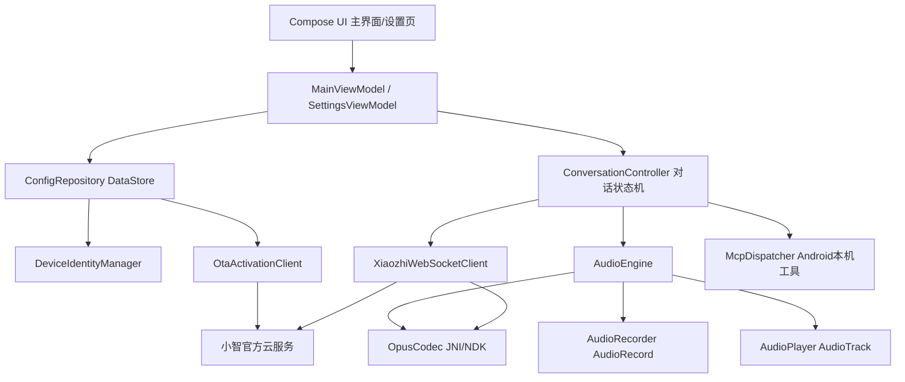

# 小智语音助手 Android 端开发计划大纲


## 1. 项目背景

本项目目标是将已经在 PC 端验证过的 `py-xiaozhi` 客户端能力迁移到 Android App 上。`py-xiaozhi` 是一个基于 Python 异步架构的跨平台 AI 交互框架，包含实时语音、视觉、多模态、MCP 工具、WebSocket/MQTT 通信、GUI/CLI/GPIO 多界面等能力；但它的桌面 GUI、音频栈、Python 运行环境并不适合直接搬到 Android。([GitHub](https://github.com/huangjunsen0406/py-xiaozhi "GitHub - huangjunsen0406/py-xiaozhi: Open-source AI assistant ecosystem with MCP integrations, multimodal workflows, IoT support, and cross-platform voice interaction. · GitHub"))

Android 版不做“Python 程序套壳”，而是以 `py-xiaozhi` 和 `xiaozhi-esp32` 为行为与协议参考，重新实现一个原生 Android 客户端。核心优先级是：**先跑通小智官方云服务连接、激活、WebSocket 握手、文本消息、语音上下行音频，再逐步补齐 UI、设置页、MCP、唤醒词、摄像头等能力。**

## 2. 项目目标

### 2.1 终极目标

复刻 `py-xiaozhi` 在 PC 端的主要客户端能力到 Android App，包括：

| 能力           | Android 目标                                                                 |
| ---------------- | ------------------------------------------------------------------------------ |
| 小智云服务通信 | OTA/激活、WebSocket 连接、hello 握手、JSON 消息、Opus 二进制音频             |
| 主界面         | 待命状态、表情/头像区域、按住后说话、打断对话、文字输入、发送、手动/自动对话 |
| 参数设置       | 系统选项、网络配置、激活信息、音频配置、唤醒词配置、摄像头配置、快捷操作配置 |
| 语音能力       | 麦克风采集、Opus 编码、WebSocket 二进制上传、服务端 TTS Opus 下行、播放      |
| 文本能力       | 输入文字后通过`listen/detect/text`或等价协议触发对话                     |
| MCP 能力       | 在 Android App 内实现手机端原生 MCP 工具，不使用 PC sidecar                  |
| 多模态扩展     | 后续支持 Android 摄像头、图片输入、手机能力控制                              |

### 2.2 第一阶段目标

第一阶段不追求完整语音助手体验，只验证服务端连通性：

```text
Android App 启动
→ 生成客户端 ID 和设备 ID
→ OTA / 激活流程
→ 拿到 WebSocket URL 和 token
→ 建立 WebSocket
→ 发送 hello
→ 收到服务端 hello
→ 发送一条文本消息
→ 收到服务端 JSON 响应
```

`xiaozhi-esp32` 的 WebSocket 文档说明，设备端建立连接时会设置 `Authorization`、`Protocol-Version`、`Device-Id`、`Client-Id` 请求头，然后发送 `type=hello`，后续 JSON 文本用于 STT/TTS/MCP 等控制消息，二进制帧用于 Opus 音频。([GitHub](https://github.com/78/xiaozhi-esp32/blob/main/docs/websocket_zh.md "xiaozhi-esp32/docs/websocket_zh.md at main · 78/xiaozhi-esp32 · GitHub"))

## 3. 非目标与边界

### 3.1 当前明确不做

1. 不把 `py-xiaozhi` 的 Python/PySide6 GUI 直接嵌入 Android。
2. 不使用 PC 端便签 App 的 sidecar。
3. 不把 PC 本地 MCP 工具直接搬进 Android。
4. 第一阶段不做唤醒词、AEC、摄像头、多模态识别。
5. 第一阶段不做后台长时间监听。

### 3.2 MCP 约束

Android 版 MCP 必须分两类处理：

| 类型                          | 处理方式                         |
| ------------------------------- | ---------------------------------- |
| 手机端 MCP 工具               | Android App 内原生实现           |
| PC 端便签 App / PC 工具       | 暂时排除，不纳入本项目           |
| 小智云服务下发的 MCP JSON-RPC | Android App 解析并分发到本机工具 |

`xiaozhi-esp32` 文档中 MCP 通过 `type: "mcp"` 传输，payload 是 JSON-RPC 2.0，服务端可以下发 `tools/call`，设备端返回 result。Android 版应复刻这个协议形态，但工具实现必须是 App 内部手机能力，而不是 sidecar。([GitHub](https://github.com/78/xiaozhi-esp32/blob/main/docs/websocket_zh.md "xiaozhi-esp32/docs/websocket_zh.md at main · 78/xiaozhi-esp32 · GitHub"))

## 4. 技术路线

### 4.1 推荐技术栈

| 层级        | 技术                                       |
| ------------- | -------------------------------------------- |
| 开发语言    | Kotlin                                     |
| UI          | Jetpack Compose                            |
| 架构        | MVVM + Repository + UseCase/Controller     |
| 状态管理    | ViewModel + StateFlow                      |
| 本地配置    | Jetpack DataStore                          |
| WebSocket   | OkHttp WebSocket                           |
| HTTP/OTA    | OkHttp 或 Retrofit                         |
| 音频采集    | Android AudioRecord                        |
| 音频播放    | Android AudioTrack                         |
| Opus 编解码 | libopus + JNI/NDK，或稳定 Android Opus AAR |
| 日志        | Timber / Android Logcat                    |
| 构建        | Gradle Kotlin DSL                          |
| 版本管理    | Git + GitHub                               |

Jetpack Compose 是 Android 官方推荐的新式原生 UI 工具包；ViewModel 适合承载 UI 层业务逻辑并把事件委托给其他层；DataStore 适合异步、事务化地保存 key-value 或 typed object 配置。([Android Developers](https://developer.android.com/develop/ui?hl=zh-cn&utm_source=chatgpt.com "开发界面 | Jetpack Compose | Android Developers"))

WebSocket 建议使用 OkHttp，因为 OkHttp 官方支持 WebSocket 生命周期，连接会经历 Connecting、Open 等状态；录音使用 Android 原生 `AudioRecord`，播放使用 `AudioTrack` 的 streaming mode。([Square Open Source](https://square.github.io/okhttp/5.x/okhttp/okhttp3/-web-socket/?utm_source=chatgpt.com "WebSocket - square.github.io"))

### 4.2 工具使用建议

主力开发使用 ​**Android Studio**​。Android Studio 是官方 Android IDE，提供 Gradle 构建、模拟器、调试、Logcat、Compose 预览、GitHub 集成、NDK 支持等能力。([Android Developers](https://developer.android.com/studio/intro?hl=zh-cn&utm_source=chatgpt.com "探索 Android Studio | Android Developers"))

VSCode 只作为辅助：

```text
Android Studio：
  - Android App 主开发
  - UI 编写
  - Gradle 同步
  - 模拟器 / 真机调试
  - Logcat
  - Git 提交
  - 打包 APK

VSCode：
  - 阅读 py-xiaozhi 源码
  - 写迁移笔记
  - 写协议对照文档
  - 写临时脚本
```

## 5. 总体架构



## 6. 核心协议设计

### 6.1 WebSocket 握手

Android App 建立 WebSocket 时需要携带：

```text
Authorization: Bearer <token>
Protocol-Version: 1
Device-Id: <device-id>
Client-Id: <client-id>
```

`py-xiaozhi` 的 `WebsocketProtocol` 也是从配置中读取 WebSocket URL、access token、device id、client id，并在连接时设置这些请求头。([GitHub](https://github.com/huangjunsen0406/py-xiaozhi/blob/main/src/protocols/websocket_protocol.py "py-xiaozhi/src/protocols/websocket_protocol.py at main · huangjunsen0406/py-xiaozhi · GitHub"))

### 6.2 hello 消息

连接成功后发送：

```json
{
  "type": "hello",
  "version": 1,
  "features": {
    "mcp": true
  },
  "transport": "websocket",
  "audio_params": {
    "format": "opus",
    "sample_rate": 16000,
    "channels": 1,
    "frame_duration": 20
  }
}
```

服务端返回 `type=hello` 后，可能携带 `session_id` 和服务端音频参数；设备端需要保存 `session_id`，后续 `listen`、`abort`、`mcp` 都应携带。([GitHub](https://github.com/78/xiaozhi-esp32/blob/main/docs/websocket_zh.md "xiaozhi-esp32/docs/websocket_zh.md at main · 78/xiaozhi-esp32 · GitHub"))

### 6.3 文本输入

第一阶段文本输入可以复刻 `py-xiaozhi` 的唤醒词触发形式：

```json
{
  "session_id": "xxx",
  "type": "listen",
  "state": "detect",
  "text": "你好，测试一下"
}
```

`py-xiaozhi` 的协议基类里 `send_wake_word_detected` 会发送 `type=listen`、`state=detect`、`text=<wake_word>`；`xiaozhi-esp32` 文档也把 `state=detect` 描述为检测到唤醒词/文本触发的消息。([GitHub](https://github.com/huangjunsen0406/py-xiaozhi/blob/main/src/protocols/protocol.py "py-xiaozhi/src/protocols/protocol.py at main · huangjunsen0406/py-xiaozhi · GitHub"))

### 6.4 按住说话

按下按钮：

```json
{
  "session_id": "xxx",
  "type": "listen",
  "state": "start",
  "mode": "manual"
}
```

松开按钮：

```json
{
  "session_id": "xxx",
  "type": "listen",
  "state": "stop"
}
```

同时，按下期间 Android 端通过 `AudioRecord` 采集 PCM，Opus 编码后通过 WebSocket binary frame 发送。WebSocket 文档说明版本 1 的二进制协议是直接发送 Opus 音频数据，无额外元数据。([GitHub](https://github.com/78/xiaozhi-esp32/blob/main/docs/websocket_zh.md "xiaozhi-esp32/docs/websocket_zh.md at main · 78/xiaozhi-esp32 · GitHub"))

### 6.5 打断对话

```json
{
  "session_id": "xxx",
  "type": "abort",
  "reason": "user_interruption"
}
```

文档中 `abort` 用于终止当前说话或语音通道；服务端 TTS 开始、结束分别使用 `{"type":"tts","state":"start"}` 和 `{"type":"tts","state":"stop"}`，客户端据此切换播放状态。([GitHub](https://github.com/78/xiaozhi-esp32/blob/main/docs/websocket_zh.md "xiaozhi-esp32/docs/websocket_zh.md at main · 78/xiaozhi-esp32 · GitHub"))

## 7. Android 代码仓库结构

建议新建仓库，不直接在 `py-xiaozhi` 仓库里开发。

```text
xiaozhi-android/
├── README.md
├── docs/
│   ├── android_migration_plan.md
│   ├── protocol_notes.md
│   ├── py_xiaozhi_mapping.md
│   ├── mcp_android_tools.md
│   └── test_checklist.md
├── app/
│   ├── build.gradle.kts
│   └── src/main/
│       ├── AndroidManifest.xml
│       ├── java/com/example/xiaozhi/
│       │   ├── MainActivity.kt
│       │   ├── app/
│       │   │   ├── XiaozhiApplication.kt
│       │   │   └── AppModule.kt
│       │   ├── ui/
│       │   │   ├── main/
│       │   │   │   ├── MainScreen.kt
│       │   │   │   ├── MainViewModel.kt
│       │   │   │   └── components/
│       │   │   ├── settings/
│       │   │   │   ├── SettingsScreen.kt
│       │   │   │   ├── SystemSettingsScreen.kt
│       │   │   │   ├── AudioSettingsScreen.kt
│       │   │   │   ├── WakeWordSettingsScreen.kt
│       │   │   │   ├── CameraSettingsScreen.kt
│       │   │   │   └── McpSettingsScreen.kt
│       │   │   └── theme/
│       │   ├── domain/
│       │   │   ├── ConversationController.kt
│       │   │   ├── ConversationState.kt
│       │   │   ├── ListeningMode.kt
│       │   │   └── UseCases.kt
│       │   ├── data/
│       │   │   ├── config/
│       │   │   │   ├── AppConfig.kt
│       │   │   │   ├── ConfigRepository.kt
│       │   │   │   └── ConfigKeys.kt
│       │   │   ├── identity/
│       │   │   │   ├── DeviceIdentity.kt
│       │   │   │   └── DeviceIdentityManager.kt
│       │   │   └── ota/
│       │   │       ├── OtaActivationClient.kt
│       │   │       ├── OtaModels.kt
│       │   │       └── ActivationState.kt
│       │   ├── network/
│       │   │   ├── XiaozhiWebSocketClient.kt
│       │   │   ├── XiaozhiMessage.kt
│       │   │   ├── MessageParser.kt
│       │   │   └── NetworkState.kt
│       │   ├── audio/
│       │   │   ├── AudioEngine.kt
│       │   │   ├── AudioRecorder.kt
│       │   │   ├── AudioPlayer.kt
│       │   │   ├── OpusCodec.kt
│       │   │   └── Resampler.kt
│       │   ├── mcp/
│       │   │   ├── McpDispatcher.kt
│       │   │   ├── McpToolRegistry.kt
│       │   │   ├── McpTool.kt
│       │   │   └── tools/
│       │   │       ├── DeviceInfoTool.kt
│       │   │       ├── VolumeTool.kt
│       │   │       ├── FlashlightTool.kt
│       │   │       └── AppOpenTool.kt
│       │   └── util/
│       │       ├── JsonUtil.kt
│       │       ├── Logger.kt
│       │       └── PermissionUtil.kt
│       └── cpp/
│           ├── CMakeLists.txt
│           └── opus_jni.cpp
├── scripts/
│   ├── pull_py_xiaozhi_refs.sh
│   └── compare_protocol_notes.py
├── .github/
│   └── workflows/
│       └── android-ci.yml
├── .gitignore
└── settings.gradle.kts
```

## 8. 模块职责

| 模块                | 职责                                                                |
| --------------------- | --------------------------------------------------------------------- |
| `ui/main`       | 主界面：状态栏、表情、按住说话、打断、文本输入、发送、手动/自动模式 |
| `ui/settings`   | 参数设置页：系统、网络、音频、唤醒词、摄像头、MCP                   |
| `domain`        | 对话状态机，统一处理待命、连接中、聆听中、说话中、错误等状态        |
| `data/config`   | 持久化配置，保存 OTA URL、授权 URL、WebSocket URL、token、音频参数  |
| `data/identity` | 生成并保存 Android 客户端 ID、设备 ID、序列号、激活密钥             |
| `data/ota`      | OTA 请求、激活请求、验证码展示、token 和 WebSocket URL 更新         |
| `network`       | WebSocket 建连、hello、JSON 收发、binary 音频收发、断线重连         |
| `audio`         | 录音、播放、Opus 编解码、采样率处理、音频队列                       |
| `mcp`           | Android 本机 MCP 工具注册、tools/list、tools/call、result 返回      |
| `util`          | 日志、权限、JSON、错误处理等工具类                                  |

## 9. 设备身份与配置策略

Android 端不要尝试读取真实手机 MAC 地址。Android 官方对唯一标识符有隐私建议，文档明确强调选择合适的标识符，并包含“不要使用 MAC 地址”的指导。([Android Developers](https://developer.android.google.cn/identity/user-data-ids?hl=en&utm_source=chatgpt.com "Best practices for unique identifiers | Identity | Android Developers"))

建议策略：

```text
client_id:
  - 首次启动生成 UUID
  - 永久保存到 DataStore

device_id:
  - 首次启动生成伪 MAC，例如 02:xx:xx:xx:xx:xx
  - 永久保存到 DataStore
  - 用户点击“重置设备身份”后重新生成

hmac_key / activation info:
  - 激活流程需要时生成
  - 保存到本地
  - 不提交到 GitHub

websocket_url / access_token:
  - 优先从 OTA 返回结果更新
  - 设置页可显示
  - token 默认隐藏
```

## 10. 分阶段开发计划

### Phase 0：建仓库与环境验证

目标：

```text
- 新建 Android Studio 项目
- 确认 Kotlin + Compose 可运行
- 配置 Git
- 推送到 GitHub
- 建立 docs 目录
```

验收标准：

```text
- 模拟器能启动空 App
- 真机能安装空 App
- GitHub 仓库存在 main 分支
- README.md 和 docs/android_migration_plan.md 已提交
```

Android Studio 支持 Git、GitHub 等版本控制系统，可通过 VCS 菜单启用版本控制；GitHub 文档也说明可以把本地仓库推送到远程仓库。([Android Developers](https://developer.android.com/studio/projects/version-control?utm_source=chatgpt.com "Version control basics | Android Studio | Android Developers"))

### Phase 1：UI 骨架


目标：

```text
- 复刻主界面核心布局
- 实现状态文本：待命 / 连接中 / 聆听中 / 说话中 / 错误
- 实现按钮：按住后说话、打断对话、输入文字、发送、手动对话、参数设置
- 实现设置页导航
```

验收标准：

```text
- 不接入服务端也能模拟状态切换
- 按住按钮时显示“聆听中”
- 松开按钮时回到“待命”
- 点击打断回到“待命”
- 设置页可以进入和返回
```

### Phase 2：配置、设备身份、OTA/激活


目标：

```text
- 实现 ConfigRepository
- 实现 DeviceIdentityManager
- 实现 OtaActivationClient
- 设置页展示 client_id、device_id、OTA URL、授权 URL、激活状态
- 支持重置设备身份
- 支持重新激活
```

验收标准：

```text
- 首次启动自动生成 client_id 和 device_id
- 重启 App 后 ID 不变
- 可以请求 OTA
- 如果需要激活，可以显示验证码
- 激活成功后保存 WebSocket URL 和 token
```

### Phase 3：WebSocket 文本连通性


目标：

```text
- 实现 XiaozhiWebSocketClient
- 携带 Authorization / Protocol-Version / Device-Id / Client-Id
- onOpen 后发送 hello
- 收到服务端 hello 后保存 session_id
- 文本输入框发送 listen/detect/text
- Logcat 打印服务端 JSON
```

验收标准：

```text
- App 可以连接小智官方 WebSocket
- 可以收到服务端 hello
- 可以发送文本消息
- 可以收到 STT / LLM / TTS / system / mcp 等 JSON 中至少一种响应
- 失败时 UI 显示错误原因
```

### Phase 4：语音上行


目标：

```text
- 申请 RECORD_AUDIO 权限
- 使用 AudioRecord 采集 PCM16
- 固定 16000Hz / mono / 20ms 或 60ms 帧
- Opus 编码
- WebSocket binary frame 上传
- 按住说话时发送 listen/start/manual
- 松开时发送 listen/stop
```

验收标准：

```text
- 真机按住说话后，服务端能识别用户语音
- Logcat 能看到 STT 文本
- 音频线程不会阻塞 UI
- 松开按钮后录音停止
```

如果后续涉及后台录音或前台服务，需要注意 Android 14 对前台服务类型和权限声明的要求。([Android Developers](https://developer.android.com/about/versions/14/changes/fgs-types-required?utm_source=chatgpt.com "Foreground service types are required | Android Developers"))

### Phase 5：语音下行与播放

目标：

```text
- 接收 WebSocket binary frame
- Opus 解码为 PCM
- 使用 AudioTrack streaming mode 播放
- 收到 tts/start 进入说话状态
- 收到 tts/stop 停止播放并回到待命或自动监听
```

验收标准：

```text
- 用户说话后能听到小智回复
- TTS 播放期间 UI 显示“说话中”
- TTS 停止后 UI 状态正确恢复
- 打断时立即停止本地播放
```

### Phase 6：完整对话状态机

目标：

```text
- ConversationState:
  - Idle
  - Activating
  - Connecting
  - Connected
  - Listening
  - Thinking
  - Speaking
  - Error

- ConversationController:
  - connect()
  - sendText()
  - startManualListening()
  - stopListening()
  - abort()
  - reconnect()
  - close()
```

验收标准：

```text
- 用户快速连续点击不会导致状态错乱
- 网络断开后能提示并尝试重连
- session_id 丢失时能重新建立连接
- 任何异常都能回到可操作状态
```

### Phase 7：设置页补齐

目标：

```text
系统选项：
  - 客户端 ID
  - 设备 ID
  - OTA URL
  - 授权 URL
  - WebSocket URL
  - Access Token 隐藏显示
  - 激活版本
  - 重新激活
  - 重置配置

音频设置：
  - 输入采样率
  - 输出采样率
  - frame_duration
  - Opus 参数
  - 播放音量

唤醒词设置：
  - UI 预留
  - 第一版不实现离线唤醒

摄像头设置：
  - UI 预留
  - 后续接 CameraX

MCP 设置：
  - 本机工具开关
  - tools/list 预览
  - 调试日志
```

验收标准：

```text
- 参数修改后能保存
- 重启 App 后参数仍然存在
- 重置配置能恢复默认值
- 敏感 token 不明文暴露在日志中
```

### Phase 8：Android 本机 MCP

目标：

```text
- 实现 McpToolRegistry
- 实现 tools/list
- 实现 tools/call
- 实现 result / error 返回
- 第一批 Android 本机工具：
  - 获取设备信息
  - 调节音量
  - 打开 App
  - 手电筒开关
  - 获取当前电量
  - 获取网络状态
```

验收标准：

```text
- 服务端下发 tools/list 时，Android 能返回工具列表
- 服务端下发 tools/call 时，Android 能调用本机工具
- 工具调用失败时返回 JSON-RPC error
- 不依赖 PC sidecar
```

### Phase 9：摄像头、唤醒词、AEC、自动对话

预计时间：后续增强阶段。

目标：

```text
- CameraX 接入
- 图片帧上传或视觉识别接口接入
- 离线唤醒词模型调研
- Android AcousticEchoCanceler / WebRTC AEC 调研
- 自动对话模式
- 通知栏快捷操作
- 蓝牙耳机兼容
```

验收标准：

```text
- 摄像头权限和预览正常
- 唤醒词不会显著增加耗电
- AEC 开关可控
- 自动模式不会误触发大量请求
```

## 11. GitHub 同步方案

### 11.1 仓库建议

仓库名：

```text
xiaozhi-android
```

不要把它放进 `py-xiaozhi` 源仓库。推荐单独建仓库，后续可以在 README 里说明它是 Android 迁移实现。

### 11.2 初始命令

```bash
git init
git add .
git commit -m "init android xiaozhi client"
git branch -M main
git remote add origin git@github.com:<your-name>/xiaozhi-android.git
git push -u origin main
```

### 11.3 不应提交的内容

```text
local.properties
*.jks
keystore.properties
真实 access token
真实 hmac_key
真实设备激活信息
真实服务端私有配置
```

## 12. 关键风险

| 风险                       | 说明                                         | 应对                                         |
| ---------------------------- | ---------------------------------------------- | ---------------------------------------------- |
| OTA/激活协议细节不完全稳定 | 官方云服务可能更新字段                       | 先做 Logcat 全量打印，保留原始响应           |
| Android 音频延迟           | AudioRecord/AudioTrack/Opus 队列可能造成延迟 | 先固定 20ms 或 60ms 帧，逐步调优             |
| Opus JNI 复杂              | NDK 编译和 ABI 兼容可能踩坑                  | 第一版可先用成熟 AAR，稳定后再换自编 libopus |
| session\_id 管理错误       | listen/abort/mcp 依赖 session\_id            | 收到 hello 后统一写入 ConversationController |
| 权限问题                   | 录音、通知、前台服务、摄像头都需要运行时权限 | 分阶段申请，不一次性申请全部                 |
| MCP 范围失控               | 工具能力太多会拖慢主线                       | 只做 Android 本机工具，PC 便签相关全部排除   |
| UI 过早复杂化              | 还没连通服务端就做动画会浪费时间             | 第一阶段只做可用 UI                          |

## 13. 第一周执行清单

第一周只做这些：

```text
Day 1:
  - 新建 Android 项目
  - 建 GitHub 仓库
  - 提交 README 和开发计划
  - 做主界面静态版

Day 2:
  - 做按钮交互和假状态机
  - 做设置页骨架
  - 做 ConfigRepository

Day 3:
  - 生成 client_id / device_id
  - 实现 OTA URL 配置
  - 开始写 OtaActivationClient

Day 4:
  - 跑通 OTA/激活
  - 保存 WebSocket URL 和 token
  - 设置页显示激活状态

Day 5:
  - 实现 WebSocket client
  - 发送 hello
  - 收到服务端 hello
  - 输入文字发送测试消息
```

第一周验收目标：

```text
Android App 可以完成：
  - 启动
  - 设置页查看设备身份
  - OTA/激活
  - WebSocket 连接
  - hello 握手
  - 文本消息发送
  - 服务端 JSON 响应查看
```

## 14. 当前版本 Definition of Done

当以下条件满足时，可以认为 Android 迁移进入“主链路可用”状态：

```text
- 真机可安装运行
- 可完成设备激活
- 可连接小智官方 WebSocket
- 可发送 hello 并收到 hello
- 可通过文本输入触发一轮对话
- 可按住说话上传音频
- 可播放服务端 TTS 音频
- 可打断当前 TTS
- 设置页可修改核心网络和音频参数
- MCP 框架存在，但只包含 Android 本机工具
- 所有敏感 token 不进入 GitHub
```

## 15. 开发原则

```text
协议优先，UI 次之。
先文本，后语音。
先手动，后自动。
先前台，后后台。
先官方云连通，后 MCP。
MCP 只做 Android 本机工具，不接 PC sidecar。
每个阶段都必须有可验证结果。
```

